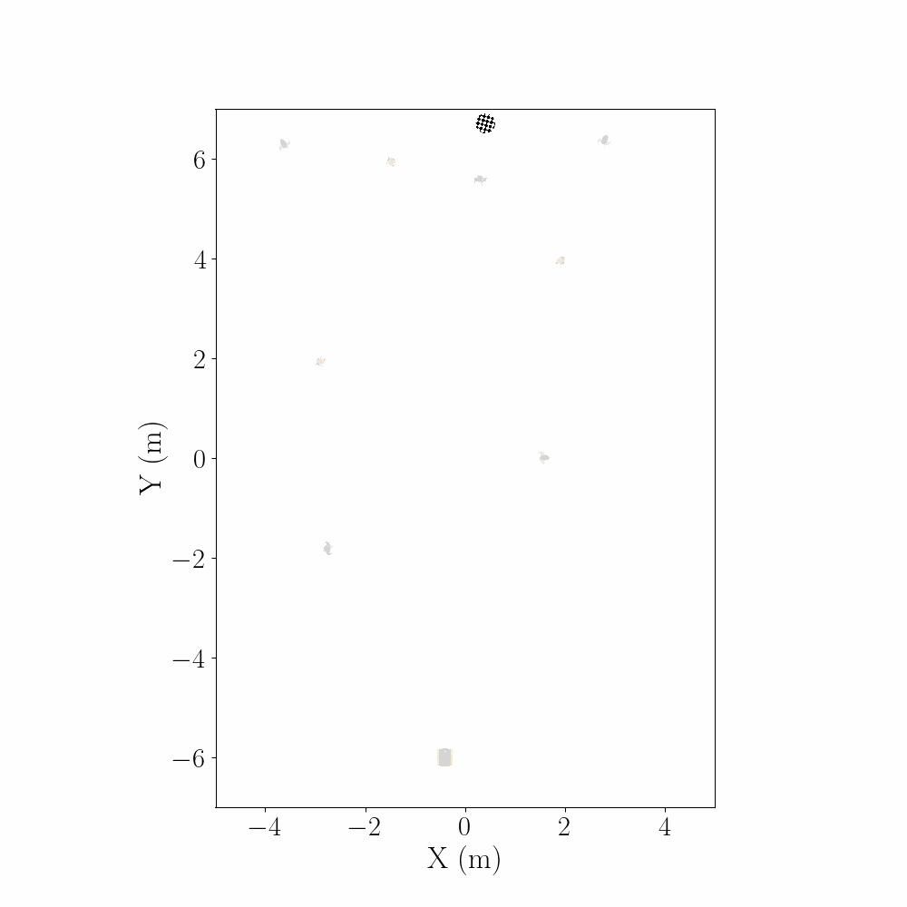
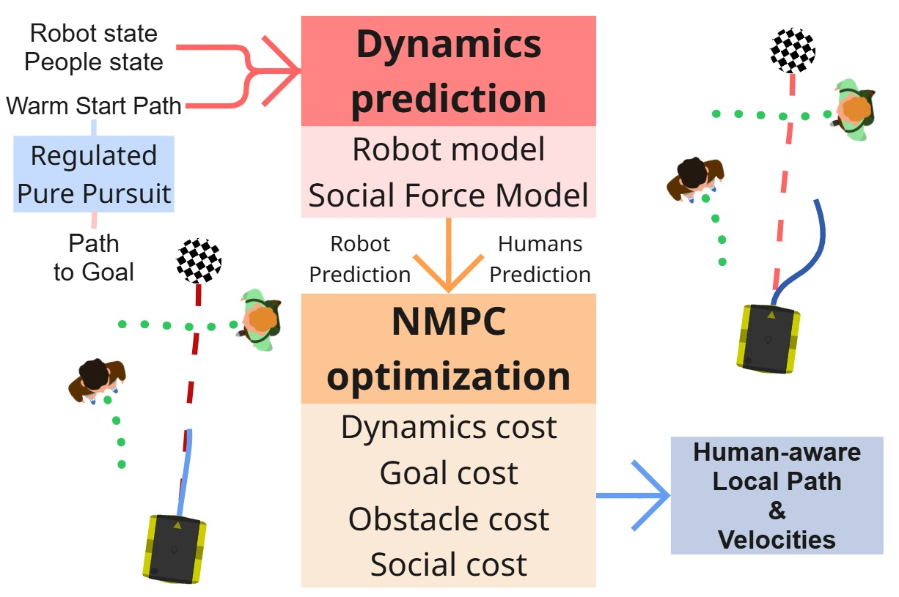
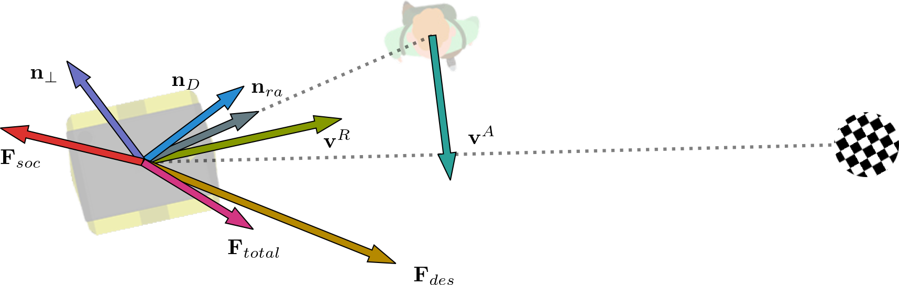

[](https://docs.ros.org/en/humble/)
[](https://navigation.ros.org/)
[](http://ceres-solver.org/)
[](https://www.gnu.org/licenses/gpl-3.0)
TODO add correct reference link
[](https://arxiv.org/abs/2107.00606)

<h1 align="center">SFM-NMPC: Social-Force-Aware Nav2 Controller</h1>

<p align="center">
  
</p>

`sfm_nmpc` is a Nav2 controller plugin that optimizes short-horizon velocity commands with Ceres. It combines classical trajectory-tracking critics with Social Force Model (SFM) social costs, so the robot can plan toward goals while respecting nearby people, proxemics, and social flow.

## At a glance



The controller uses:

- a unicycle rollout model for robot predictions over the horizon,
- a critic stack assembled in `optimizer` that forms a single weighted least-squares objective,
- SFM-based future agent states that are co-predicted and coupled into social penalties each cycle.

Social interaction terms and force components are visualized below.



## Documentation-driven implementation details

The package behavior is documented in `src/sfm-nmpc/docs`:

- [Cost function formulation](docs/mpc_critics_methodology.md) including horizon setup, state rollout, and critic math.
- [Critic catalog and usage notes](docs/critics.md) for all 11 critics, with YAML examples.

## What the controller does

- Solves a nonlinear least-squares optimization each control cycle (`optimizer` block in params).
- Optimizes angular and linear velocity blocks with configurable horizon/block settings.
- Combines 11 modular critics: path tracking, goal behavior, obstacle safety, motion smoothness, and social interaction.
- Exposes the Nav2 plugin class `sfm_nmpc::MPCSFMMotionModel`.

### Current critics

- Path tracking: `DistanceCost`, `AngleCost`
- Goal behavior: `GoalAlignCost`, `GoalProximityCost`
- Safety: `ObstacleCost`
- Smoothness: `VelocityCost`, `VelocityFeasibilityCost`
- Social: `SocialWorkCost`, `ProxemicsCost`, `AgentAngleCost`, `CrossingCost`

## Package structure

| Path | Purpose |
| --- | --- |
| `CMakeLists.txt` | Builds `sfm_nmpc` and `sfm_nmpc_critics` shared libraries and exports `sfm_nmpc.xml`. |
| `include/sfm_nmpc/` | Public headers for plugin, optimizer, trajectorizer, critics, and helper interfaces. |
| `src/` | Implementation of all core components (plugin, optimizer, cost functions, interfaces). |
| `params/` | Benchmark and baseline YAML presets. |
| `docs/` | Full math notes, critic explanations, and configuration guidance. |

## Build and install

From the workspace root:

```bash
cd ~/ros2_ws
rosdep install --from-paths src --ignore-src -r -y
colcon build --packages-select sfm_nmpc
source install/setup.bash
```

## Use in Nav2

1. Configure the controller plugin:

```yaml
controller_server:
  ros__parameters:
    use_sim_time: True
    controller_frequency: 20.0
    controller_plugins: ["FollowPath"]
    FollowPath:
      plugin: "sfm_nmpc::MPCSFMMotionModel"
      trajectorizer:
        desired_linear_vel: 0.6
        lookahead_dist: 1.0
        max_angular_vel: 1.4
        time_step: 0.05
        max_time: 1.5
      optimizer:
        linear_solver_type: "DENSE_SCHUR"
        control_horizon: 18
        parameter_block_length: 6
        weights:
          distance_weight: 20.0
          angle_weight: 250.0
          obstacle_weight: 0.13
          social_weight: 720.0
          proxemics_weight: 40.0
          agent_angle_weight: 40.0
          velocity_feasibility_weight: 5.0
```

2. Launch Nav2:

```bash
ros2 launch nav2_bringup navigation_launch.py use_sim_time:=True \
  params:=$PWD/src/sfm-nmpc/params/params.yaml
```

3. Tune behavior by editing critic weights and optimizer limits in the parameter files.

## Preset parameters

- `params/params.yaml` – default social-aware navigation stack.
- `params/obst_only_parameters_in_benchmark.yaml` – obstacle-only ablation.
- `params/soc_work_obst_parameters_in_benchmark.yaml` – social-work-emphasized crowd variant.

## Development notes

- **Build profile**: defaults to `Release` and keeps `-fPIC` enabled for plugin compatibility.
- **Testing**: CI path is to enable `BUILD_TESTING` and add `test/` gtests; current upstream validation is simulation-benchmark based.
- **Formatting**: Nav2/ament lint configuration is declared in `package.xml`.

# Citations
Remind users to cite your work, e.g.:

This repository is intended for scientific research purposes.
If you want to use this code for your research, please cite our work ([Paper Name](https://arxiv.org/)).

```
[.bib citation here]
```

# References
[Other references that should be cited when using this repository here]

# Acknowledgements
[Acknowledgements here]

<p align="left">
  
</p>